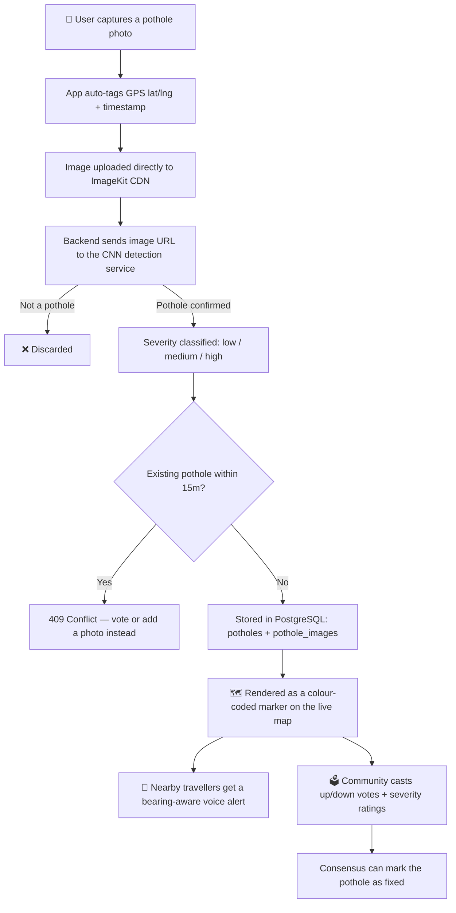
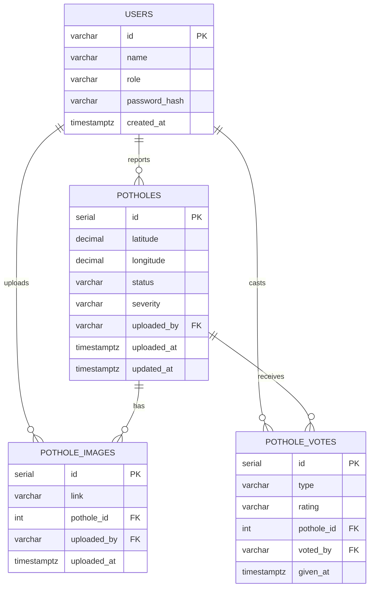

# 🚧 Pothole Detection & Alert System

**Crowd-sourced, AI-verified pothole reporting with a live map and direction-aware voice alerts.**

---

Every day, riders and drivers hit potholes they never saw coming, and cities have no real-time picture of where their roads are actually falling apart. This project turns every phone into a sensor: snap a photo, a fine-tuned CNN verifies it's genuinely a pothole and grades how bad it is, it lands on a live map colour-coded like an AQI layer, and anyone heading toward it gets warned — out loud — before they hit it.

## 📖 Table of Contents

- [Overview](#-overview)
- [Key Features](#-key-features)
- [How It Works](#-how-it-works)
- [Database Schema](#-database-schema)
- [Security](#-security)

## 🔎 Overview

The system has five stages that work together as a single pipeline:

1. **Capture** — a user photographs a pothole; GPS coordinates and a timestamp are attached automatically.
2. **Verify** — the image is handed to a fine-tuned CNN detection service, which confirms it's actually a pothole and scores its severity (`low` / `medium` / `high`). Anything that isn't a pothole is discarded before it ever touches the database.
3. **Map** — confirmed potholes are plotted on a live, theme-aware map with severity-coloured markers, the way an AQI or traffic layer works.
4. **Alert** — as people travel, the system checks what's directly ahead of their heading using bearing geometry and speaks a warning.
5. **Verify (crowd)** — the wider community up/down-votes a report and rates its severity, keeping the map honest over time.

## ✨ Key Features

- **📸 One-tap capture & geotagging** — no manual data entry; location and time are captured automatically at the moment of upload.
- **🧠 CNN-verified detection & severity scoring** — every submission is classified by a fine-tuned MobileNetV2 model before it's stored, so the map only ever fills up with real, sized reports.
- **☁️ Direct-to-CDN uploads** — images go straight from the browser to ImageKit using short-lived, signed tokens, so raw image bytes never have to pass through the API server.
- **🗺️ Live interactive map** — a MapLibre GL map scoped to Kolkata with light/dark theming, colour-coded severity markers, and a coordinate picker.
- **🧭 Bearing-based real-time alerts** — the system first finds all potholes close to the vehicle, then uses the initial bearing (forward azimuth) formula to calculate the compass direction from the vehicle to each pothole, compares that direction with the vehicle's current heading, and alerts the driver only if the pothole lies within a 30° cone in front of the vehicle — delivered as a spoken **"Warning. Pothole ahead. Please slow down."** via the Web Speech API.
- **🗳️ Crowd verification** — riders can upvote/downvote a report and rate its severity, so stale or exaggerated reports can be corrected by consensus rather than a single upload.
- **🚫 Smart deduplication** — new submissions are checked against a 15 m radius; if a pothole already exists there, the API returns a conflict and points the user to voting or adding another photo instead of creating a duplicate.
- **🔐 Role-based accounts** — JWT sessions in `httpOnly` cookies, `bcrypt` + application-wide pepper for password hashing, and ownership middleware that lets admins act on any resource while regular users can only touch their own.

## 🔄 How It Works

### 1️⃣ User Side — Data Collection

**Step 1: Capture pothole image 📸**
- User opens the app and takes a photo of a pothole
- The app automatically collects GPS location (latitude, longitude) and time of capture
- No manual input needed from the user

**Step 2: Upload to server 📤**
- The image is uploaded directly to the ImageKit CDN using a short-lived, signed token
- The resulting image URL, together with the GPS coordinates, is sent to the backend

### 2️⃣ Backend + Deep Learning Processing

**Step 3: Pothole detection using CNN (Convolutional Neural Network) 🧠**
- Server receives the image
- Image is passed to a fine-tuned MobileNetV2 CNN model:
  - The image is downloaded, converted to RGB, resized to 224×224 px, and rescaled to a 0–1 range
  - A MobileNetV2 convolutional backbone extracts features, feeding into a `GlobalAveragePooling2D → Dense(128, ReLU) → Dropout(0.3) → Dense(1, Sigmoid)` classification head
  - The model outputs a single confidence score between 0 and 1
- Model checks:
  - **Is this a pothole?** — a score above 0.5 confirms it; otherwise the image is rejected
  - **How severe is it?** — the confidence score is bucketed into a severity grade (reference thresholds: ≥ 0.98 → *High*, ≥ 0.80 → *Medium*, otherwise → *Low*)
- The returned severity label is normalised to match the database schema (`low` / `medium` / `high`) before it's stored

📊 Output: `is_pothole` (Yes/No) and `severity` (Low/Medium/High)

❌ If NOT a pothole → discarded, nothing is stored
✅ If pothole → continue

**Step 4: Store pothole data 🗄️**
If confirmed, the backend stores latitude & longitude, severity level, image link, and timestamp — building up the pothole database that powers everything downstream.

### 3️⃣ Map Visualization (Like an AQI Layer)

**Step 5: Display potholes on the map 🗺️**
- The map loads pothole data from the database
- Colour-coded markers show status and severity at a glance:
  - 🔴 Red → High severity
  - 🟠 Orange → Medium severity
  - 🟡 Yellow → Low severity
  - 🟢 Green → Marked as fixed
- Just like an AQI or traffic layer on Google Maps

### 4️⃣ Alert & Safety System

**Step 6: Real-time, bearing-aware pothole warning ⚠️**
- The system first finds all potholes close to the vehicle
- It then uses the **initial bearing (forward azimuth) formula** to calculate the compass direction from the vehicle to each nearby pothole
- That direction is compared against the vehicle's current heading
- The driver is alerted **only if the pothole lies within a 30° cone directly in front of the vehicle** — filtering out potholes that are nearby but off to the side or behind
- Works for both bike riders and car drivers, with the warning spoken aloud so eyes never have to leave the road

> **Initial bearing (forward azimuth):**
> θ = atan2( sin(Δλ)·cos(φ₂), cos(φ₁)·sin(φ₂) − sin(φ₁)·cos(φ₂)·cos(Δλ) )
> where φ₁, φ₂ are the vehicle's and pothole's latitudes and Δλ is the difference in longitude between them.

### 5️⃣ Crowd Verification (Reliability)

**Step 7: User confirmation system 👥**
- Other users passing the same road can:
  - ✔️ Confirm the pothole still exists, with a severity rating
  - ❌ Downvote a pothole that's been fixed
- Votes and ratings are recorded against each pothole, feeding a consensus mechanism built to flip a pothole's status to *fixed* or adjust its severity once enough agreement is reached
- 📌 Aims to reduce fake, stale, or already-repaired potholes cluttering the map

## 🗄️ Database Schema

## 🔒 Security

- Ownership middleware requires a non-admin user to re-enter their password before updating or deleting their own account, or before deleting their own pothole report; admins can act across resources without this extra check but still cannot delete other admin accounts.